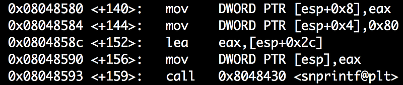
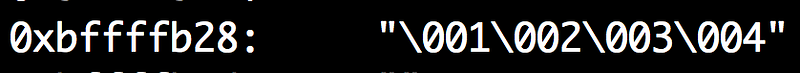
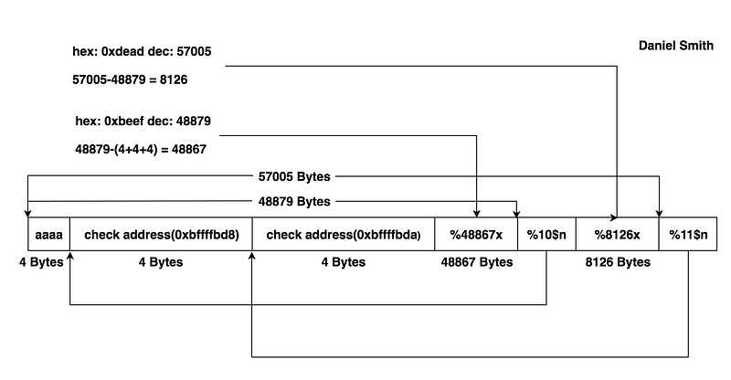
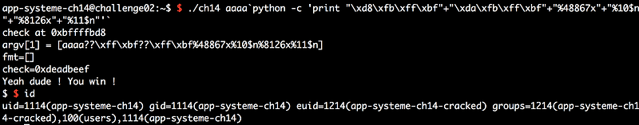

이번 문제는 FSB 를 트리거하여 `check` 변수의 값을 `0xdeadbeef` 로 덮는것이 목표입니다.

`printf()` 계열 함수는 포맷 스트링을 인자로 받는데, 여기에 사용자 입력값이 들어가게 되면 입력값에 포함된 포맷스트링이 해석되어 FSB 취약점이 발생합니다.

```c
#include <stdio.h>
#include <stdlib.h>
#include <sys/types.h>
#include <unistd.h>

int main(int argc, char **argv)

{

    int var;
    int check = 0x04030201;

    char fmt[128];

    if (argc < 2) exit(0);

    memset(fmt, 0, sizeof(fmt));

    printf("check at 0x%x\n", & check);
    printf("argv[1] = [%s]\n", argv[1]);

    snprintf(fmt, sizeof(fmt), argv[1]);

    if ((check != 0x04030201) && (check != 0xdeadbeef))
        printf("\nYou are on the right way !\n");

    printf("fmt=[%s]\n", fmt);
    printf("check=0x%x\n", check);

    if (check == 0xdeadbeef) {
        printf("Yeah dude ! You win !\n");
        setreuid(geteuid(), geteuid());
        system("/bin/bash");
    }
}
```

`snprintf()` 의 함수 원형을 보면 세번째 인자는 포맷 스트링이 들어가야 하는 자리이지만 문제 코드를 보면 세번째 인자에 사용자 입력값이 들어가고 있습니다.

```c
int snprintf(char *s, size_t n, const char *format, ...);
```

gdb 로 `snprintf()` 함수를 호출하는 부분에 BP 를 걸고 포맷 스트링을 넘겨서 실행중에 `fmt` 변수값이 어떻게 변하는지 봅시다.



main+159 에서 step over 하니 `fmt` 변수(`0xbffffb28`) 에 임의의 주소값이 덧붙여졌습니다.




FSB가 발생하는 것은 확인했고, 이제 목표는 `check`변수에 `0xdeadbeef`를 덮어쓰고 검증을 통과해 쉘을 얻는 것 입니다.

`%n` 은 FSB 의 핵심인데, 지금까지 출력된 문자 갯수를 카운트 하여 int 타입으로 특정 주소에 write 할 수 있습니다.

하지만 `0xdeadbeef` 를 `%n` 으로 한번에 쓰려면 3735928559자의 문자열을 출력해야 하고 signed int 범위도 초과하여 음수로 인식하니, 4바이트를 통째로 저장하지 않고 2바이트씩 쪼개서 write 하도록 하겠습니다.

아래 페이로드 구조를 보면 한눈에 이해가 될것 같습니다.



payload 의 길이에 따라 check 의 주소값이 변하기 때문에 어느정도의 게싱은 필요합니다.



읽어주셔서 감사합니다