이번 글에서는 Windows XP 지뢰찾기를 동적 분석하여 **타이머를 수정**하고 **지뢰 배치를 확인**할 수 있는 코드를 작성하는 과정을 살펴보겠습니다.

윈도우 GUI 프로그램은 기본적으로 창 단위로 구성되고, 해당 창에서 일어나는 이벤트를 핸들링 하기 위한 프로시저가 존재합니다.

지뢰찾기의 핵심 로직은 결국 이 프로시저에 존재하게 되어있습니다.

그렇다면 프로시저의 주소는 어떻게 찾을까요? 윈도우 API 를 사용해 창을 생성하려면 무조건 `RegisterClass()` 를 호출하여 해당 창의 정보를 등록해야 합니다.

```c
ATOM RegisterClassA(
  [in] const WNDCLASSA *lpWndClass
);
```

이때 넘어가는 `WNDCLASSA` 구조체를 살펴보면 프로시저의 주소값을 담는 `lpfnWndProc` 필드가 보입니다.

```cpp
typedef struct tagWNDCLASSA {
  UINT      style;
  WNDPROC   lpfnWndProc;
  int       cbClsExtra;
  int       cbWndExtra;
  HINSTANCE hInstance;
  HICON     hIcon;
  HCURSOR   hCursor;
  HBRUSH    hbrBackground;
  LPCSTR    lpszMenuName;
  LPCSTR    lpszClassName;
} WNDCLASSA, *PWNDCLASSA, *NPWNDCLASSA, *LPWNDCLASSA;
```

즉, `RegisterClass()` 를 호출하는 부분에 BP 를 찍은 뒤 스택 구조를 분석하면 프로시저의 주소를 알아낼 수 있습니다.

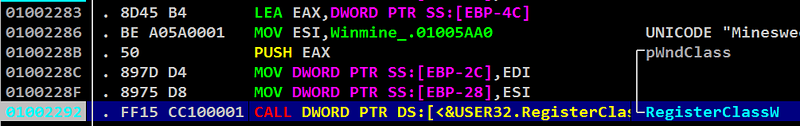

`RegisterClass()` 직전 멈췄는데, 임의의 `WNDCLASS` 주소가 스택에 푸시되었습니다.

호출 직전 스택 구조는 어떨까요?

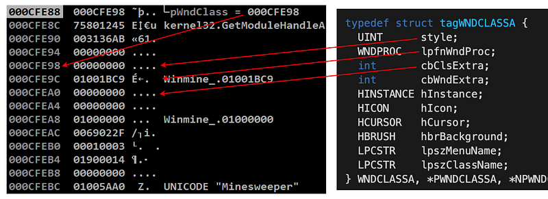

이해를 돕기위해 구조체 필드에 대응되는 값들에 화살표를 그려봤습니다.

위 사진에서 esp 주소에 있는 주소는 `WNDCLASS` 구조체의 주소(`0x000CFE98`) 인데, 32비트 프로그램이니 `lpfnWndProc` 은 esp에 4를 더한 주소인 `0x000CFE9C` 가 됩니다.

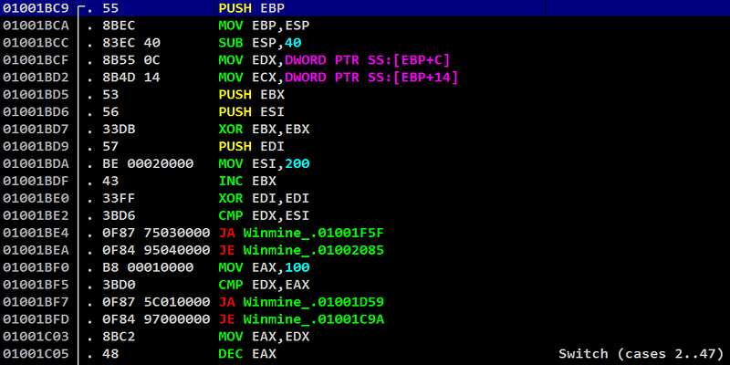

프로시저에 들어오면 switch 문에서 윈도우 메시지에 따라 분기하는 코드가 보입니다. Microsoft 공식 문서에서도 자주 보이는 프로시저의 전형적인 패턴입니다.

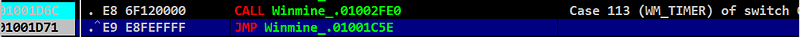

쭉 내려가보니 `0x01002FE0` 주소를 호출할 때 마다 게임 시간이 1초씩 증가됩니다.

타이머 값을 수정하는 것도 목표니 들어가서 확인해보겠습니다

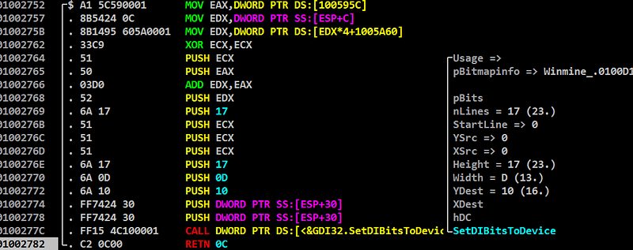

`SetDIBitsToDevice()` 함수를 호출하여 그래픽적인? 타이머를 그리고 있었습니다.

그래픽을 그리는 쪽이라면 그 원본 값도 가지고 있을 것 같아 `SetDIBitsToDevice()` 자체에 BP 를 걸어놓고 Continue 를 시켜봤는데, 매번 멈출때마다 edi 가 타이머 값과 동일한 값을 가지고 있으니 이 값을 넣어주는 부분을 찾아야 합니다.

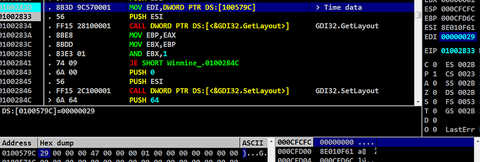

사진에서 하이라이트된 부분(`0x0100282D`)에서 edi 에 시간값을 넣어주고 있었고, 게임 시간의 원본 값은 `0x0100579c`에 저장되어 있었습니다.

해당 값을 500초로 수정하여 진짜 원본값이 맞는지 확인 해보겠습니다.

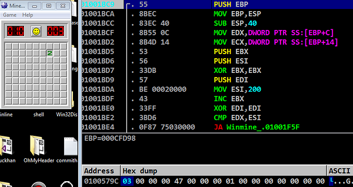

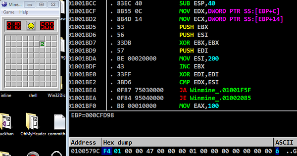

정상 반영이 되었으니 코드로도 작성해보겠습니다.

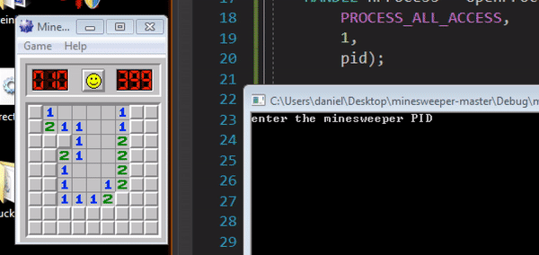

이제 타이머 분석은 끝났고, 지뢰를 배치하는 과정을 분석해보도록 하겠습니다.

지뢰의 위치는 새 게임을 시작할 때 마다 "랜덤"으로 배치됩니다.

지뢰를 배치하기 전, `rand()` 함수를 호출할 가능성이 높아 BP 를 걸었더니 예상대로 새 게임마다 BP 에 걸렸습니다.

`rand()` 함수 자체를 분석하는 것이 아니니 step out 을 하였는데 `rand()` 함수를 실행하고 나서 특정 메모리 영역에 어떤 값을 규칙적이게 write 하는 것을 보고 "게임 맵인가?" 하는 의심이 들었습니다.

당연히 위치의 기준으로 사용할 랜덤값을 받았다면 그걸 활용해 게임맵상에 뭔가를 써야겠죠?

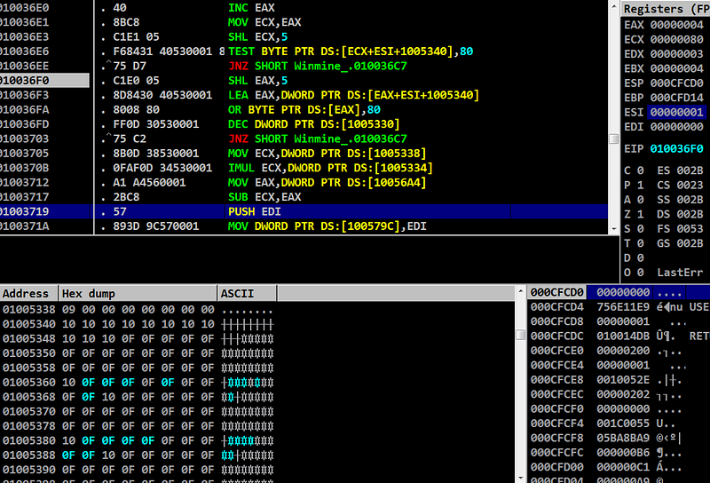

그래서 로직을 분석해보니, 지뢰가 이미 존재하면 `rand()` 를 한 번 더 호출하고 없으면 그대로 배치하는 방식입니다.

또한 해당 메모리 영역을 수정하였을 때 게임 맵에 영향이 가는 것으로 보아 게임 맵이 맞다고 확신하였습니다.

분석 결과, 게임 맵에서 각 값에 대한 의미는 다음과 같습니다.


*   숫자: 0x41 ~ 0x48
    

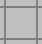

*   배경: 0x40
    


*   클릭하기 전: 0x0F
    


*   지뢰가 매설된 곳: 0x8F, 밟아서 노출된 지뢰(게임오버): 0x8A
    
*   게임 맵 배열의 끝: 0x10
    

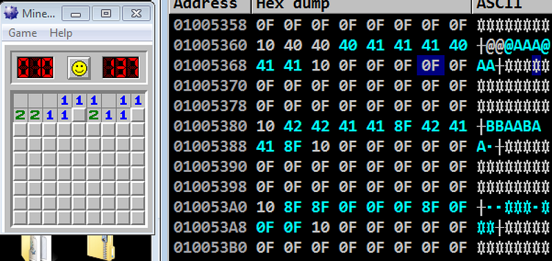

지뢰찾기 게임은 초급/중급/고급 난이도별로 게임 판의 크기가 결정되는데, 메모리에서 보이는 `0x0f` 는 난이도에 따라 가변적으로 사용되는 영역이고 `0x10` 은 현재 게임 맵의 끝입니다.

이제 지뢰의 위치를 노출시켜보도록 하겠습니다.

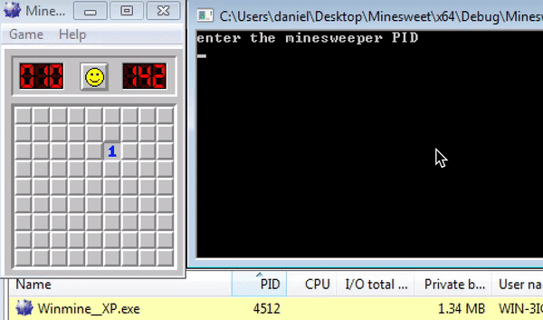

보호 기법이 있을리 없는 오래된 프로그램이다 보니 분석이 수월했습니다.

읽어주셔서 감사합니다.