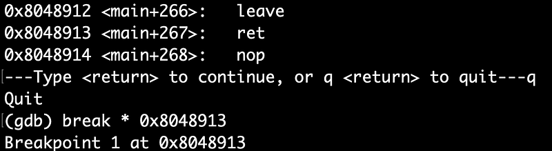
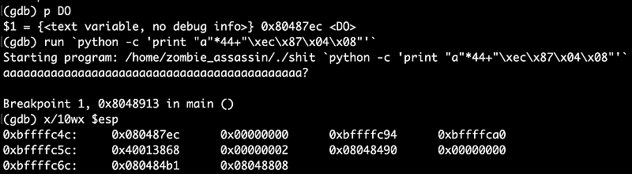
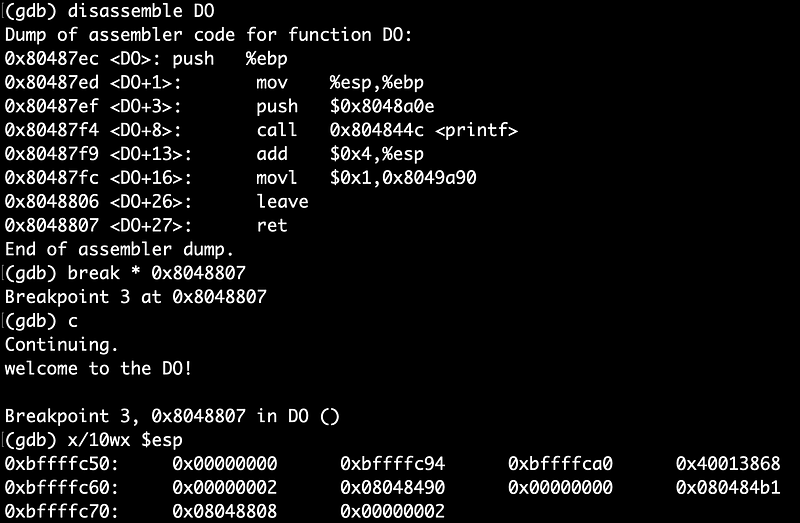
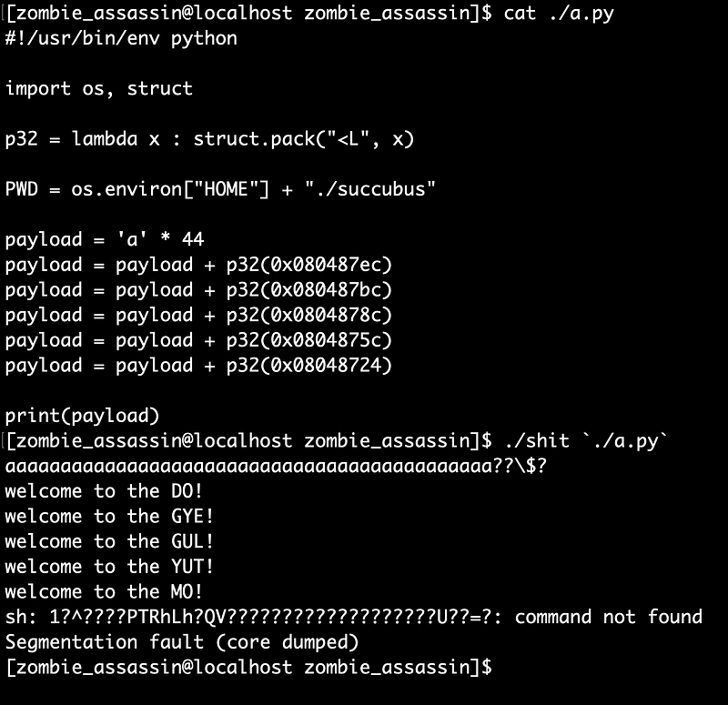
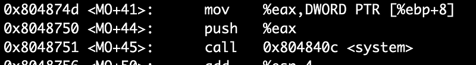
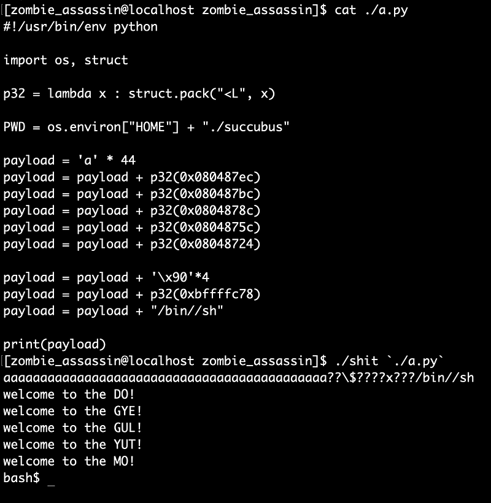

이번 문제는 함수를 체이닝 하는 간단한 문제입니다.

```c
/*
    The Lord of the BOF : The Fellowship of the BOF
    - succubus
    - calling functions continuously
*/

#include <stdio.h>
#include <stdlib.h>
#include <dumpcode.h>

// the inspector
int check = 0;

void MO(char * cmd) {
    if (check != 4)
        exit(0);

    printf("welcome to the MO!\n");

    // olleh!
    system(cmd);
}

void YUT(void) {
    if (check != 3)
        exit(0);

    printf("welcome to the YUT!\n");
    check = 4;
}

void GUL(void) {
    if (check != 2)
        exit(0);

    printf("welcome to the GUL!\n");
    check = 3;
}

void GYE(void) {
    if (check != 1)
        exit(0);

    printf("welcome to the GYE!\n");
    check = 2;
}

void DO(void) {
    printf("welcome to the DO!\n");
    check = 1;
}

main(int argc, char * argv[]) {
    char buffer[40];
    char * addr;

    if (argc < 2) {
        printf("argv error\n");
        exit(0);
    }

    // you cannot use library
    if (strchr(argv[1], '\x40')) {
        printf("You cannot use library\n");
        exit(0);
    }

    // check address
    addr = (char * ) & DO;
    if (memcmp(argv[1] + 44, & addr, 4) != 0) {
        printf("You must fall in love with DO\n");
        exit(0);
    }

    // overflow!
    strcpy(buffer, argv[1]);
    printf("%s\n", buffer);

    // stack destroyer
    // 100 : extra space for copied argv[1]
    memset(buffer, 0, 44);
    memset(buffer + 48 + 100, 0, 0xbfffffff - (int)(buffer + 48 + 100));

    // LD_* eraser
    // 40 : extra space for memset function
    memset(buffer - 3000, 0, 3000 - 40);
}
```

여러 제약 조건들로 인해 출제자의 의도대로 `DO()`, `GYE()`, `GUL()`, `YUT()`, `MO()` 함수를 체이닝 할수밖에 없습니다.

1.  함수는 반드시 순서대로 호출
    
2.  RTL 불가(libc 주소에 `0x40` 포함됨)
    
3.  첫 ret 영역에는 반드시 `DO()` 가 들어가야함
    
4.  페이로드 길이 제한(buffer+148 까지)
    
5.  `LD_PRELOAD` 같은 환경변수 트릭 불가
    

원본 바이너리는 setuid 가 걸려있기 때문에 동적 분석을 위해 바이너리를 복사하여 gdb 로 실행시켜 보겠습니다.



더미 44바이트 + `DO()` 의 주소를 넘기고 실행해봤습니다.



이제 `DO()` 가 끝나고 ret가 수행될때 esp가 어디를 가르키는지 오프셋을 확인해야합니다.

사실 `DO()` ~ `MO()` 함수들은 모두 함수 프롤/에필로그를 가지고 있기 때문에 일렬로 나열만 해주면 순차적으로 실행이 되지만...

그래도 눈으로 확인하면 재밌으니까 확인 해보겠습니다.

main+267(ret) 에선 esp 가 `0xbffffc4c` 를 가르키고 있습니다. `DO()` 의 ret 에 BP 를 걸고 esp 와 `0xbffffc4c` 간의 오프셋을 구하면 `GYE()` 함수의 주소가 어디에 들어가야 하는지 알수있습니다.



DO+27(ret) 에선 esp 가 `0xbffffc50` 을 가르키고 있으니 오프셋은 4입니다.

이제 나머지 함수들을 일렬로 호출해주면 됩니다.



이제 `MO()` 까지 호출하는건 성공했고 `void MO(char *cmd)` 에 `/bin//sh` 문자열 주소를 전달해야 합니다.



`MO()` 내부에서 ebp+8 에 적힌 값을 인자로 받아 `system()` 으로 넘기고 있기 때문에 `/bin//sh` 문자열을 스택에 미리 배치해놓고 그 주소값을 ebp+8 에 넣어놔야 합니다.

현재 페이로드에 더미 4바이트 + /bin//sh 주소 + 실제 /bin//sh 문자열 이렇게 추가로 넣어주면 됩니다.



읽어주셔서 감사합니다.