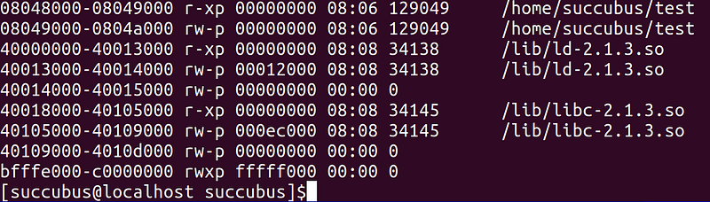
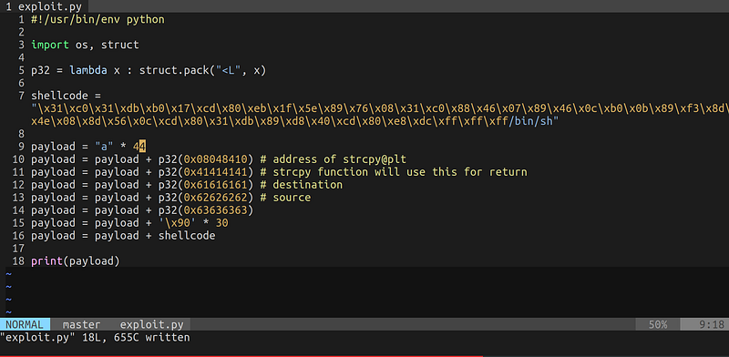
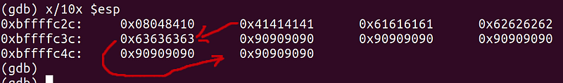
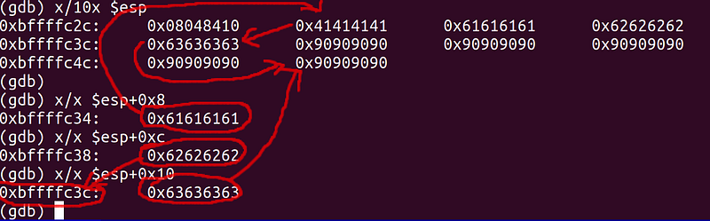
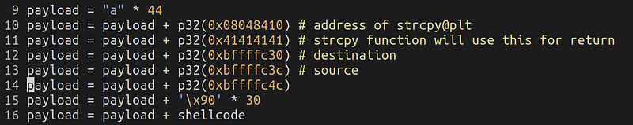
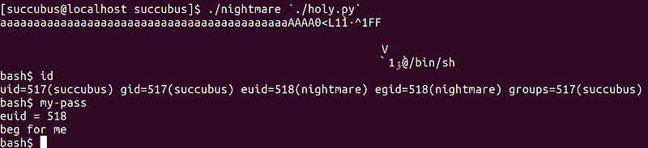

이번 문제는 간단한 ret2sc 문제입니다.

```c
/*
    The Lord of the BOF : The Fellowship of the BOF
    - nightmare
    - PLT
*/
#include <stdio.h>
#include <stdlib.h>
#include <string.h>
#include <dumpcode.h>

main(int argc, char *argv[])
{
    char buffer[40];
    char *addr;

    if(argc < 2){
        printf("argv error\n");
        exit(0);
    }

    // check address
    addr = (char *)&strcpy;
    if(memcmp(argv[1]+44, &addr, 4) != 0){
        printf("You must fall in love with strcpy()\n");
        exit(0);
    }

    // overflow!
    strcpy(buffer, argv[1]);
    printf("%s\n", buffer);

    // dangerous waterfall
    memset(buffer+40+8, 'A', 4);
}
```

풀이에 앞서 먼저 조건을 살펴보겠습니다.

1.  `main()` 의 ret 는 `strcpy@plt` 이어야 함
    
2.  `strcpy@plt` 의 ret 는 마지막에 `memset()` 이 "AAAA" 로 덮음
    
3.  스택 영역에 실행 권한 있음
    



스택에 실행 권한이 있으니 `memset()` 이 AAAA로 덮는 곳 즉, `strcpy()` 의 ret 영역을 nop slide 와 쉘코드가 붙어있는 주소로 덮으면 풀이가 가능해 보입니다.

여기서 nop slide 는 왜 끼워넣을까요? nop 는 cpu 명령어상 아무것도 하지않고 다음 명령어로 넘어가는 명령어입니다.

그런데 ret2sc 문제를 풀다보면 가끔 쉘코드의 시작 주소가 엇나가 엉뚱한 부분부터 실행될 때가 많습니다.

그래서 nop slide 를 넉넉하게 끼워주고 그 뒤에 쉘코드를 넣어주면 nop slide 내에서 약간의 주소 오차가 존재하더라도 쭉 내려가서 쉘코드를 정상적으로 실행하게 됩니다.

페이로드 구성은 이렇습니다.

```plaintext
dummy * 44
ret(strcpy@plt)
"AAAA" <- strcpy ret
address of "AAAA" <- dest
address of nop slide + shellcode <- src
```

일단 익스를 먼저 짜고 스택 주소를 뽑아 더 자세히 설명해보겠습니다.





스택에 채워둔 더미값을 기준으로 페이로드에 대해 다시 설명하면

1.  `0x41414141(0xbffffc30)` 는 `strcpy()` 의 ret 영역입니다. 여기를 덮어야 합니다.
    
2.  `0x61616161(0xbffffc34)` 는 `strcpy()` 의 dest 니까 ret 영역 주소(`0xbffffc30`)를 넣어야 합니다.
    
3.  `0x62626262(0xbffffc38)` 에는 복사할 값이 담긴 주소인 `0xbffffc3c` 주소를 넣어야 합니다. `strcpy()` 는 src 주소를 역참조해 내용을 복사하기 때문에 그렇습니다.
    
4.  `0x63636363(0xbffffc3c)` 에는 nop slide 의 임의 주소를 넣으면 됩니다. 주로 중간쯤에 존재하는 주소를 넣고, `strcpy()` 가 ret 를 수행하면 nop slide 를 타다가 쉘코드를 실행하게 됩니다.
    

이후에 nop slide 와 쉘코드를 넣어주면 됩니다.



이해를 위해 그림으로 표현해봤습니다.



익스를 수정해서 원본 바이너리에 인수로 넘겨주면 끝입니다.



읽어주셔서 감사합니다.