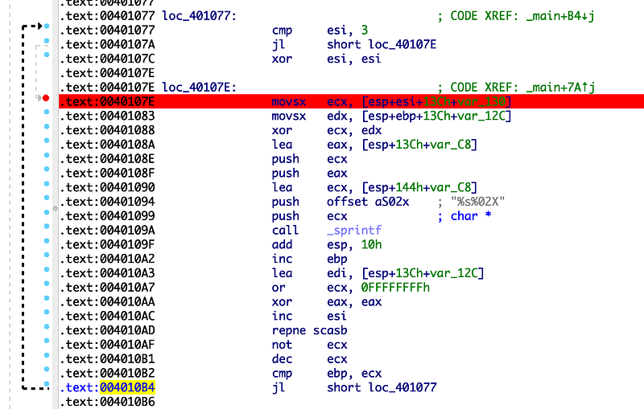
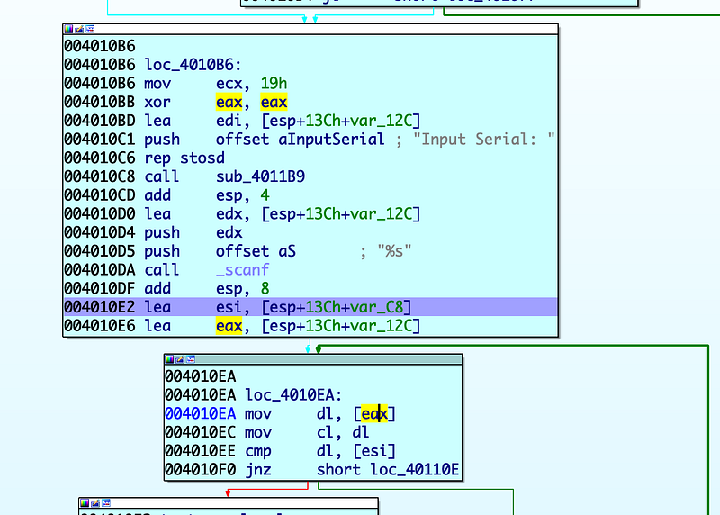
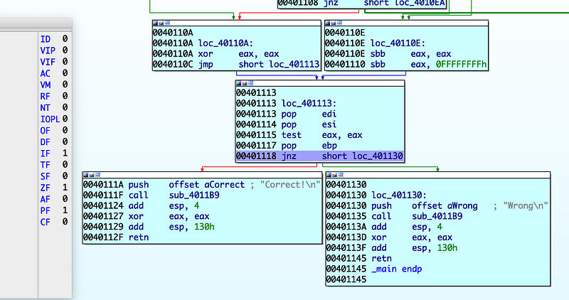
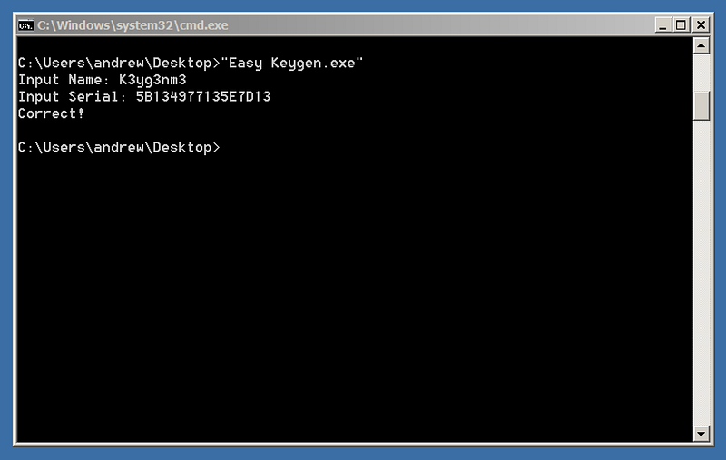

이번 문제는 간단한 키젠을 제작하는 문제입니다.

문제 설명을 보면 시리얼 키가 `5B134977135E7D13` 일때의 name 을 찾아달라고 합니다.

분석 도중 입력 받은 name 에 대해 조건에 따라 xor 연산을 반복하는 부분을 보았습니다.

```plaintext
.text:00401000 var_130         = byte ptr -130h
.text:00401000 var_12F         = byte ptr -12Fh
.text:00401000 var_12E         = byte ptr -12Eh

.text:00401038                 mov     [esp+140h+var_130], 10h
.text:0040103D                 mov     [esp+140h+var_12F], 20h
.text:00401042                 mov     [esp+140h+var_12E], 30h
```



`var_130` 은 `0x10`, `0x20`, `0x30` 세 값을 순환하며 `name` 배열의 각 바이트와 순차적으로 xor 연산을 수행합니다.

`var_130` 은 key 라고 칭하고 C 로 표현해보자면 `name[i] ^ key[i % 3]` 이렇게 됩니다.

그리고 xor 연산의 결과물인 `var_C8` 은 입력받은 시리얼 키와 비교된 뒤 Correct! 또는 Wrong 을 출력하게 됩니다.



이런 xor 연산의 특징으로는 A, B, C 가 있고 `A ^ B = C` 가 성립한다면 2개의 값을 알고 있는경우 나머지 하나의 값도 알아낼 수 있습니다.

그렇다면 `name` 이 "aaaa" 일때 serial 은 71415171 이어야 합니다.

"aaaa" 를 넣고 분석한 내용이 맞는지 확인해보겠습니다.



ZF 를 보면 Correct! 가 출력되었습니다.

이제 제공된 시리얼에 대응하는 이름을 찾아보겠습니다. key 와 serial 을 알고 있으니 서로 xor 연산을 수행하면 name 이 튀어나옵니다.

```python
serial = '5B134977135E7D13'
key = [0x10, 0x20, 0x30]
raw = bytes.fromhex(serial)
print("".join(chr(b ^ key[i % 3]) for i, b in enumerate(raw)))
```



읽어주셔서 감사합니다.